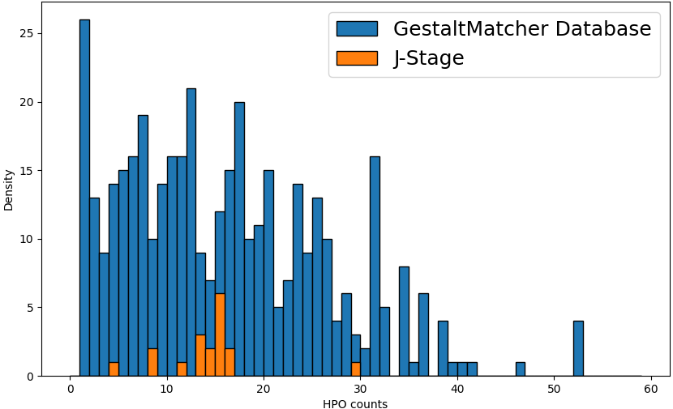
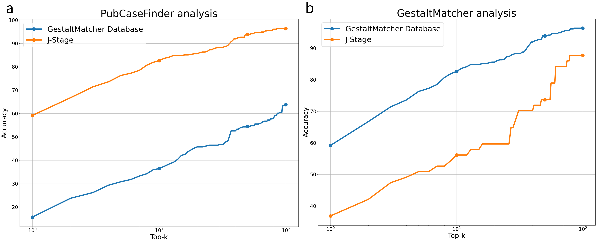

# Introduction

More than 6.2 \% of global population affected by rare diseases. Diagnosing patients with rare diseases is challenging because of the rarity and diversity of the disorders. It is often referred to as the "diagnostic odyssey" due to the long and complicated process of reaching a diagnosis. The facial analysis tools such as GestaltMatcher (GM)  [@citation:Hsieh2022-lw; @citation:Lesmann2024-wz] and Face2Gene [@citation:Gurovich2019-if; @citation:Mishima2019-fm] have been developed to assist the diagnosis of rare diseases.
Although the whole exome sequencing technology is widely used for the diagnosis of rare disease, interpreting the huge number of variants is still a challenging task. 
Therefore, considering the clinical phenotypic information together with exome data is crucial.

The next-generation phenotyping approach to analyze the clinical information such as Human Phenotype Ontology (HPO) [@citation:Gargano2024-og] and facial image have been employed in many studies to assist the diagnosis of rare disorders.
PubCaseFinder [@citation:Fujiwara2018-ve; @citation:Yamaguchi2021-kg; @citation:Fujiwara2022-uc]
 is a tool that can search similar clinical cases from the literature and is widely used in rare disease diagnosis, especially in the Japanese society.
GestaltMatcher is the state-of-the-art deep facial phenotyping approach that trained on GestaltMatcher Database (GMDB), a largest facial image database for rare diseases compliant with FAIR principles.
In this study, we aim to integrate the facial image analysis, GestaltMatcher into PubCaseFinder to analyze the Japanese cohort.

We first benchmarked the performance of GestaltMatcher and PubCaseFinder on the GMDB dataset. Moreover, we focused on the Japanese patients. We collected the clinical information encoded to HPO terms and the facial image from the publcations in the [J-STAGE](https://www.jstage.jst.go.jp/) database. 

The diagnosis of rare diseases is challenging due to the rarity of the diseases and the lack of expertise. The facial analysis tools such as GestaltMatcher and Face2Gene have been developed to assist the diagnosis of rare diseases. The PubCaseFinder is a tool that can search similar clinical cases from the literature. The integration of facial analysis tools into PubCaseFinder can help the clinicians to diagnose the rare diseases more efficiently.

# Materials and Methods

## Data Source
The J-STAGE is a a public platform for scholarly publications in Japan. The site is developed and managed by the Japan Science and Technology Agency. Most of archived documents were written in Japanse. In this study, PDF files of peer-reviewed  clinical case reports in J-STAGE were searched manually using relevant words related to each syndrome, and downloaded manually. From GMDB, facial images, diagnoses, and HPO annotation of syndromes in the J-Stage dataset (Table 1) were downloaded. 

**Table 1 | Syndromes analyzed in this study**
| syndrome                   | omim ID | case   | 
| --------                   | ------  | ----   | 
| Angelman syndrome          | 105830  | 1      |
| Cockayne  syndrome         | 216400  | 3      |
| Coffin-Lowry syndrome      | 303600  | 3      |
| Cornelia de Lange syndrome | 122470  | 2      |
| Kabuki syndrome            | 147920  | 9      |
| Mucopolysaccharidosis I    | 607014-607016| 1 |
| Mucopolysaccharidosis II   | 309900 | 2       |
| Noonan syndrome            | 163950  | 9      |
| Prader-Willi syndrome      | 176270  | 13     |
| Rubinstein-Taybi syndrome  | 180849  | 2      |
| Sotos sysndrome            | 117550  | 2      |
| Williams-Beuen syndrome    | 194050  | 8      |
| total                      |         | 56     |

## HPO term assignment
For the J-Stage dataset, HPO terms were assined to all case repots analyzed in this study by automatically and/or manually. Automatic HPO assignment was performed by using the free-text HPO term extraction function of PubCaseFinder. Manual HPO assignment was performed by the authors with the assistance of PubCaseFinder's ontology search function. For the GMDB dataset, HPO terms were manually assigned by medical trainees and professionals. 

# Results 
## HPO term assignment
 **Fig. 1 | Distribution of HPO term counts in GMDB and J-Stage.**

## HPO- and facial analysis-based diagnosis assistance
 **Fig. 2 | Accuracy of correct diagnonsis assistance.** HPO terms or facial images from cases in GMDB and J-Stage papers were analysed. **a**, PubCaseFinder analysis using HPO terms. **b**, GestaltMatcher analysis using facial images.

[supplemantary table 1](https://github.com/biohackathon-japan/bh24-integrating-facial-analysis-into-pubcasefinder/raw/main/paper/supplemantal-table-1.xlsx) also showes each cases analyzed in this study with information of syndrome, OMIM ID, age, sex, and J-STAGE listed paper DOI.

# Discussion

...

## Acknowledgements

...

## Supplementary Materials
Supplemental table 1 is available at https://github.com/biohackathon-japan/bh24-integrating-facial-analysis-into-pubcasefinder/raw/main/paper/supplemantal-table-1.xlsx

## References
<!-- 
%%%%%%%%%%%%%%%%%%%%%%%%%%%%%%%%%%%%%%%%%%%%%%%%%%%%%%%%%%%%%%%%%%%%%%%%%%%%%%%%%%%%%%%%%%%%%%%%%%%%%%%%%%%%%%%%%%%%%
References will be automatically added when we submit to BioHackrXiv. Instruction for authors below is commented out in the source.

# Formatting

This document use Markdown and you can look at [this tutorial](https://www.markdowntutorial.com/).

## Subsection level 2

Please keep sections to a maximum of only two levels.

## Tables and figures

Tables can be added in the following way, though alternatives are possible:

Table: Note that table caption is automatically numbered and should be
given before the table itself.

| Header 1 | Header 2 |
| -------- | -------- |
| item 1 | item 2 |
| item 3 | item 4 |

A figure is added with:

# Other main section on your manuscript level 1

Lists can be added with:

1. Item 1
2. Item 2

# Citation Typing Ontology annotation

You can use [CiTO](http://purl.org/spar/cito/2018-02-12) annotations, as explained in [this BioHackathon Europe 2021 write up](https://raw.githubusercontent.com/biohackrxiv/bhxiv-metadata/main/doc/elixir_biohackathon2021/paper.md) and [this CiTO Pilot](https://www.biomedcentral.com/collections/cito).
Using this template, you can cite an article and indicate _why_ you cite that article, for instance DisGeNET-RDF [@citesAsAuthority:Queralt2016].

The syntax in Markdown is as follows: a single intention annotation looks like
`[@usesMethodIn:Krewinkel2017]`; two or more intentions are separated
with colons, like `[@extends:discusses:Nielsen2017Scholia]`. When you cite two
different articles, you use this syntax: `[@citesAsDataSource:Ammar2022ETL; @citesAsDataSource:Arend2022BioHackEU22]`.

Possible CiTO typing annotation include:

* citesAsDataSource: when you point the reader to a source of data which may explain a claim
* usesDataFrom: when you reuse somehow (and elaborate on) the data in the cited entity
* usesMethodIn
* citesAsAuthority
* citesAsEvidence
* citesAsPotentialSolution
* citesAsRecommendedReading
* citesAsRelated
* citesAsSourceDocument
* citesForInformation
* confirms
* documents
* providesDataFor
* obtainsSupportFrom
* discusses
* extends
* agreesWith
* disagreesWith
* updates
* citati
-->
